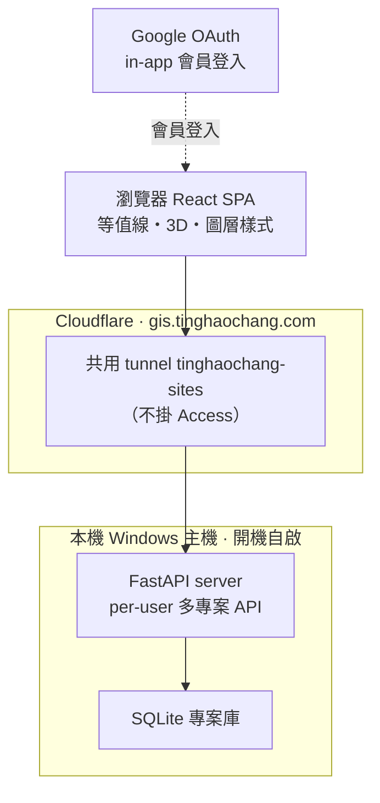

# GIS — 水文地質資料視覺化平台

地下水與土壤污染監測的 GIS 視覺化平台，支援 IDW／TIN／Kriging／Indicator 等值線內插、多物質圖層合併與樣式覆寫、buffer 空間運算，以及土壤污染調查的**垂向分頁**與 **3D 體積堆疊切片**。含 Google 登入會員系統與 per-user 多專案儲存（FastAPI／SQLite）。自學／作品集專案，已公開上線。

🔗 線上：<https://gis.tinghaochang.com>

## 系統架構

整個網站是一支跑在瀏覽器裡的 **React 單頁應用（SPA）**——等值線內插、3D 體積、圖層樣式都在瀏覽器端即時運算，不必每個動作都回伺服器。經 Cloudflare 共用 tunnel（**不掛 Access**）連到本機 Windows 主機上的 FastAPI 與 SQLite，每個登入者的專案各自隔離；會員登入是 app 自己內建的 **Google OAuth**（與 Cloudflare Access 無關）。



- **使用者端**：瀏覽器 React SPA（等值線、3D、圖層樣式皆前端即時運算）
- **外部服務**：Google OAuth（in-app 會員登入）、Cloudflare（共用 tunnel 轉送，GIS 不掛 Access）
- **本機服務**：FastAPI（per-user 多專案 API）、SQLite 專案庫（每個使用者專案隔離）

## 技術棧

- **前端**：React、TypeScript、Three.js（3D 體積）、Plotly（平滑曲面）
- **後端**：FastAPI、SQLite
- **部署**：Cloudflare Tunnel、Google OAuth

## 開發

```bash
npm install
npm run dev        # 前端（Vite）
```

後端與部署見 `server/` 與 `docs/DEPLOY.md`。

## 授權

程式碼採 [MIT License](LICENSE)。研究／作品集用途。
